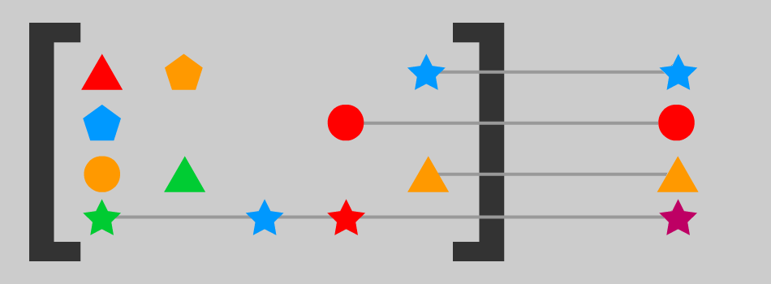

<div align="center">

# DeepmergeTS

[](https://www.npmjs.com/package/deepmerge-ts)
[](https://jsr.io/@rebeccastevens/deepmerge)
[](https://github.com/RebeccaStevens/deepmerge-ts/actions/workflows/release.yml)
[](https://codecov.io/gh/RebeccaStevens/deepmerge-ts)\
[](https://github.com/prettier/prettier)
[](https://github.com/RebeccaStevens/deepmerge-ts/discussions)
[](https://opensource.org/licenses/BSD-3-Clause)
[](https://commitizen.github.io/cz-cli/)
[](https://github.com/semantic-release/semantic-release)

Deeply merge 2 or more objects respecting type information.



</div>

## Donate

[Any donations would be much appreciated](./DONATIONS.md). 😄

### Enterprise Users

`deepmerge-ts` is available as part of the Tidelift Subscription.

Tidelift is working with the maintainers of `deepmerge-ts` and a growing network of open source maintainers to ensure
your open source software supply chain meets enterprise standards now and into the future.
[Learn more.](https://tidelift.com/subscription/pkg/npm-deepmerge-ts?utm_source=npm-deepmerge-ts&utm_medium=referral&utm_campaign=enterprise&utm_term=repo)

## Installation

### npm

```sh
# Install with npm
npm install deepmerge-ts

# Install with pnpm
pnpm add deepmerge-ts

# Install with yarn
yarn add deepmerge-ts

# Install with bun
bun add deepmerge-ts
```

### jsr

```sh
# Install in a node project
npx jsr add @rebeccastevens/deepmerge

# Install in a deno project
deno add jsr:@rebeccastevens/deepmerge

# Install in a bun project
bunx jsr add @rebeccastevens/deepmerge
```

## Features

- Smart merging - High performance.
- Merged output has correct typing.
- Record merging support.
- Array merging support.
- Map and Set merging support.
- Customized merging.

## Usage

### Example using default config

```js
import { deepmerge } from "deepmerge-ts";

const x = {
  record: {
    prop1: "value1",
    prop2: "value2",
  },
  array: [1, 2, 3],
  set: new Set([1, 2, 3]),
  map: new Map([
    ["key1", "value1"],
    ["key2", "value2"],
  ]),
};

const y = {
  record: {
    prop1: "changed",
    prop3: "value3",
  },
  array: [2, 3, 4],
  set: new Set([2, 3, 4]),
  map: new Map([
    ["key2", "changed"],
    ["key3", "value3"],
  ]),
};

const z = {
  record: {
    prop1: undefined,
    prop3: undefined,
    prop2: undefined,
    prop4: undefined,
  },
  array: undefined,
  set: undefined,
  map: undefined,
};

const merged = deepmerge(x, y, z);

console.log(merged);

// Prettierfied output:
//
// Object {
//   "record": Object {
//     "prop1": "changed",
//     "prop2": "value2",
//     "prop3": "value3",
//     "prop4": undefined,
//   },
//   "array": Array [1, 2, 3, 2, 3, 4],
//   "set": Set { 1, 2, 3, 4 },
//   "map": Map {
//     "key1" => "value1",
//     "key2" => "changed",
//     "key3" => "value3",
//   },
// }
```

You can try out this example at
[codesandbox.io](https://codesandbox.io/s/deepmerge-ts-example-iltxby?file=/src/example.ts).

### Merging into a Target

You can use `deepmergeInto` if you want to update a target object with the merge result instead of creating a new
object.

This function is best used with objects that are all of the same type.

Note: If the target object's type differs from the input objects, we'll assert that the target's type has changed
(this is not done automatically with `deepmergeIntoCustom`).

### Customized the Merging Process

We provide a customizer function for each of our main deepmerge functions: `deepmergeCustom` and `deepmergeIntoCustom`.
You can use these to customize the details of how values should be merged together.

See [deepmerge custom docs](./docs/deepmergeCustom.md) for more details.

## Performance

We use smart merging instead of the classic merging strategy which some alternative libraries use. This vastly improves
performance, both in execution time and memory usage.

### Classic Merge (not what we do)

With classic merging, each input is merged with the next input until all inputs are merged.

This strategy has large performance issues when lots of items need to be merged.


### Smart Merge (what we do)

With our smart merging, we look ahead to see what can be merged and only merge those things.

In addition to performance improvements, this strategy merges multiple inputs at once; allowing for benefits such as
taking averages of the inputs.


## API

See [API docs](./docs/API.md).
